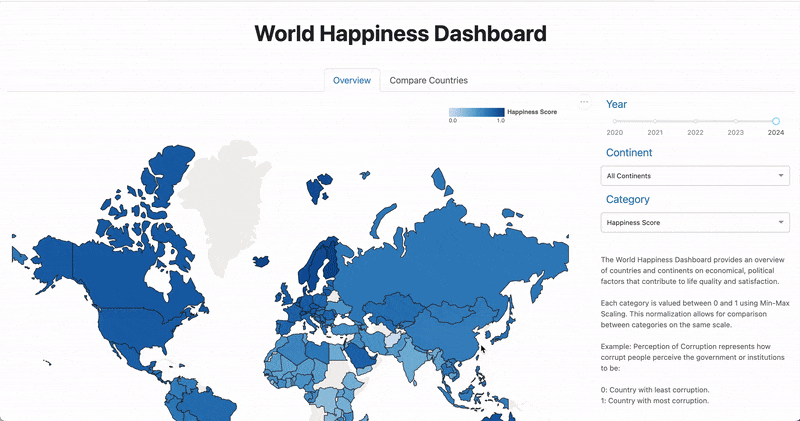

# World Happiness Dashboard

Welcome to the World Happiness Dashboard! This tool offers insights into the World Happiness Dataset (2020-2024), helping you explore factors that influence happiness across different countries. Filter by continent or specific happiness criteria to discover key insights, compare nations, and identify potential destinations for immigration based on your priorities.

## Motivation

For those looking to immigrate to new countries, it can be time-consuming to search up statistics about new countries and make decisions on which countries look most promising to settle in. Our dashboard provides an overview of countries and continents on economical, political factors that contribute to life quality and satisfaction. Additionally, an overall "Happiness Score" is provided for each country. You can apply filtering criteria such as GDP, Perception of Corruption or other factors that matter to you and see how countries compare to each other from 2020 to 2024.

## Web App

[The deployed app](https://dsci-532-2025-11-world-happiness-2.onrender.com/) may be a bit slow.



## Reporting Issues

If you want to report a problem or suggest an enhancement we'd love for you to [open an issue](https://github.com/UBC-MDS/DSCI-532_2025_11_world_happiness/issues).

## Contributing

We welcome you to contribute to our dashboard. Please check out guidelines and instructions [here](https://github.com/UBC-MDS/DSCI-532_2025_11_world_happiness/blob/main/CONTRIBUTING.md).

## Local Installation Instructions

### Step 1: In your terminal, from project root directory, create conda environment

```bash
conda env create --file environment.yml
```

### Step 2: Activate conda environment

```bash
conda activate world_happiness
```

### Step 3: Download data (can take a few minutes)

```bash
jupyter nbconvert --execute --inplace --to notebook notebooks/Happiness_data_ETL_pipeline.ipynb
```

### Step 4: Export app with FLASK

```bash
cd src
export FLASK_APP=app.py
```

### (If developing the app) Step 5: Export FLASK in debug mode

```bash
export FLASK_DEBUG=1
```

### Step 6: Run the app locally

```bash
flask run --host=127.0.0.1 --port=8050
```

### Step 7: View the app in your browser

http://127.0.0.1:8050/
