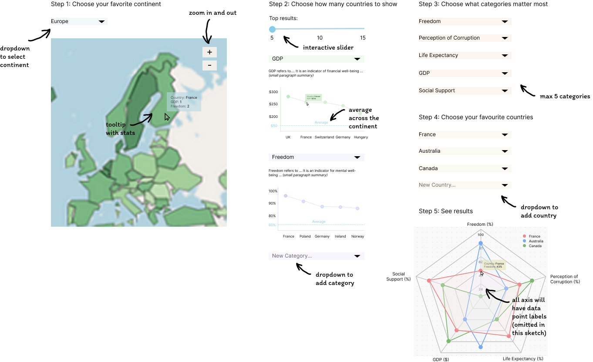
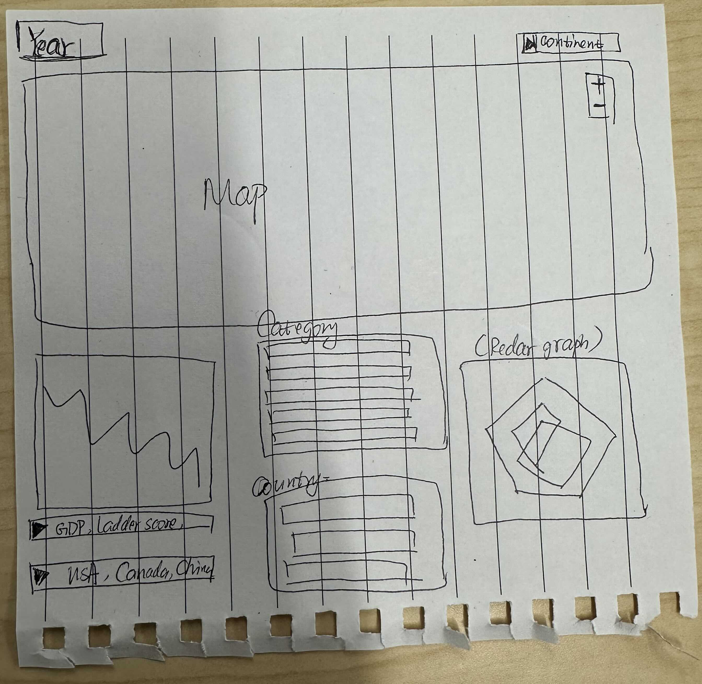

# Milestone 2 Reflection
This section should not be more than 500 words 

## What's Different From The Proposal
For anything that you have done differently than in your proposal/sketch explain why (e.g. implementation difficulty, explanation for why the new approach is more effective, etc).
Include what you are aware of is not working in your dashboard, so that your TAs can distinguish between features in development and bugs.
Explain if you have intentionally deviated from any of the best practices that we learned in 531 regarding effective visualizations.

### Dashboard Design

which parts of your proposal/sketch you have implemented in your dashboard so far and explain what is not yet implemented.

### Data Aggregation and Feature Engineering
To improve dashboard intuitiveness and effectiveness, we standardized feature names across five raw datasets and adjusted included features based on the updated design. We introduced `Region` and `Continent` to provide additional geographical context, as they were not consistently available in the raw data. Core happiness and well-being indicators, such as `Happiness Score`, `GDP per Capita`, `Social Support`, `Healthy Life Expectancy`, `Freedom to Make Life Choices`, `Generosity`, and `Perceptions of Corruption`, were retained. To enhance regional insights, we added aggregate features, including `Average Continent Happiness Score`, `Average Continent GDP per Capita`, `Average Continent Social Support`, `Average Continent Healthy Life Expectancy`, `Average Continent Freedom to Make Life Choices`, `Average Continent Generosity`, and `Average Continent Perceptions of Corruption`, which provide comparative metrics at the continental level. Additionally, we removed `Happiness Rank Change` to align with the revised design. The final dataset was compiled using an ETL process using a [python script](./notebooks/Happiness_data_ETL_pipeline.ipynb), ensuring consistency and direct integration into the visualization.

## Impact, Limitations & Opportunities
Reflect on what you think your dashboard does well currently what its limitations are, and what are good potential future improvements and additions.
and be written to the file reports/m2-reflection.md in your GitHub repo.
